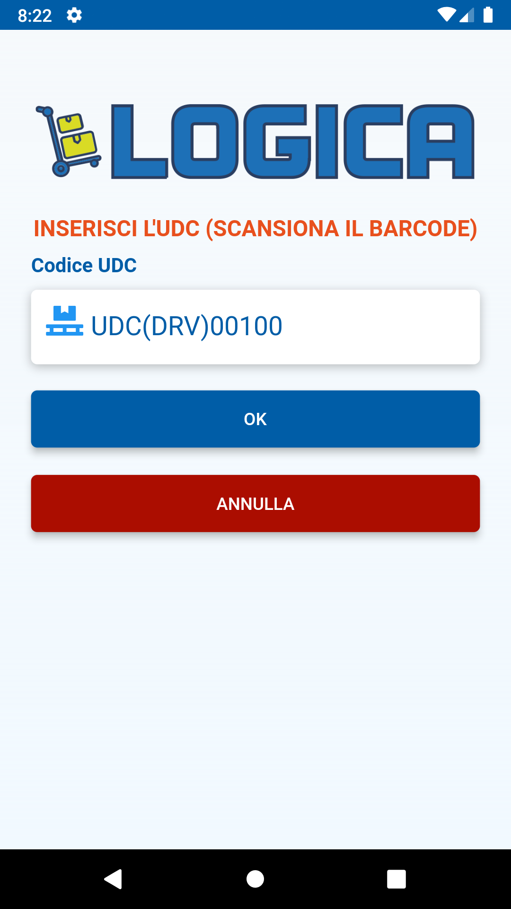

# logica_entrata_merce

Una Applicazione Flutter per gestire le entrate di magazzino.

## Getting Started

Questa applicazione è stata pensata per i PDA Android dei magazzini. Essa gestisce le entrate dei pallet quando un Automezzo scarica in magazzino la propria merce. 
Ogni pallet è identificato con un numero UDC che viene stampata su un'etichetta adesiva e incollata al pallet. Questo UDC deve essere considerato univoco per un determinato pallet.
Il magazziniere stampa le etichette e le attacca ai pallet nella baia di scarico dopo di ché procede alla catalogazione dei pallet mediante l'applicazione.
Il primo Screenshot dell'applicazione si presenta così

Per entrare usare le seguenti credenziali:

* username: **Test.User**
* password: **user.test**

Se il login va a buon fine l'applicazione riceve un token JWT che utilizzerà per tutte le successive chiamate.

La schermata successiva riguarda la scelta del magazzino.

La successiva scermata riguarda la scelta del cliente

premendo ok si prosegue alla schermata successiva per inserire la targa del automezzo che ha portato la merce

dopo di che si inserisce il codice del pallet ovvero l'UDC (unità di Carico)

La schermata successiva riguarda il barcode EAN 13 o altro dell'articolo

e successivamente viene chiesto in numero di pezzi di quell'articolo stoccato sul pallet.

Il pallet deve essere posizionato e quindi deve essere inserita la posizione all'interno del magazzino

In quest'ultima schermata è possibile inserire un nuovo UDC oppure si va al riepilogo dati prima di salvare tutto nel database.
La schermata di riepilogo è la seguente.

In questa schermata è possibile cancellare un record inserito oppure fare l'edit del numero pezzi inserito.

Cancella record:

Edit record:

Infine se si clicca sul pulsante "INVIA DATI" i record vengono salvati nel database.

## Alcune considerazioni sulle dipendenze usate

In questa applicazione sono state usate le dipendenze 

GetX per il Routing:

https://pub.dev/packages/get

e Get_Storage per conservare i dati globali durante la raccolta dei dati:

https://pub.dev/packages/get_storage

Per realizzare questa applicazione e soprattutto per utilizzare GetX ho seguito un tutorial su YouTube:

[![https://youtu.be/rI7bwmMOuXE?si=OkSaRHN4R2PalTHw]]()

Link al canale CodeX [youtu.be/rI7bwmMOuXE?si=OkSaRHN4R2PalTHw](https://youtu.be/rI7bwmMOuXE?si=OkSaRHN4R2PalTHw)

